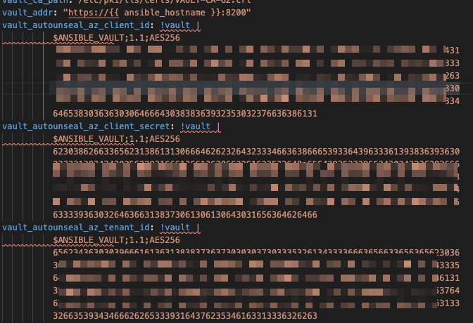

# Ansible role for Vault with Internal Storage

The following Ansible role is intended for deploying a Vault cluster with the following assumptions:

* Vault >= 1.4 RC
* Storage backend using Integrated Storage, the [RAFT backed](https://www.vaultproject.io/docs/configuration/storage/raft/) 
* No dependecy on Consul at all, just Vault
* Vault data is stored into the VM disk from a defined path. Keep at least 1 node avaible to avoid data loss.
* A given servername  will be the cluster leader, the rest of nodes will join the RAFT cluster
* TLS certificates must be provided in advance, we can use this Ansible role to meet requirements https://github.com/cesarsaez/ansible-role-opensslcaandcerts

## Role tasks

* Disables FirewallD
* Storage path creation and permissions
* User accounts
* Vault download
* Vault systemd service
* Vault config
* Enviroment variables
* Start Vault service

## Auto-Unseal prequisites
Auto Unseal was developed to aid in reducing the operational complexity of keeping the master key secure. This feature delegates the responsibility of securing the master key from users to a trusted device or service. Instead of only constructing the key in memory, the master key is encrypted with one of these services or devices and then stored in the storage backend allowing Vault to decrypt the master key at startup and unseal automatically.

In the example we are going to use **Azure KeyVault** as Auto-Unseal backend.

You must have 
* Azure CLI installed 
* JQ
* Bash/Zsh
* Logged in in your Azure accont with **az login**

Review the commands and adapt the **--name** and other parameters like **--vault-name**

`az group create --name "vault-autounseal-rg" -l "westeurope" --output json | jq`

`vault_name=$(az keyvault create --name "gaoseavaultas" --resource-group "vault-autounseal-rg" --location "westeurope" --output json)`

`vault_key=$(az keyvault key create --vault-name "gaoseavaultas" --name "autounseal" --protection software --output json)`

`spn=$(az ad sp create-for-rbac --name "vault-spn" --skip-assignment --output json)`


`az keyvault set-policy --name "gaoseavaultas" --spn $(echo $spn | jq -r .appId) --key-permissions get list recover decrypt encrypt sign verify wrapKey unwrapKey`


Use `ansible-vault` to encrypt the Azure KeyVault sensitive information into the **vars/main.yml** file of the role. Before encyrpt the sentive vars, we can use the following command to have an intermediate file with unencrypted content.

```
cat << EOF >> tmp-unencryptedvars.yml
vault_autounseal_az_client_id:  "$(echo $spn | jq -r .appId)"
vault_autounseal_az_client_secret: "$(echo $spn | jq -r .password)"
vault_autounseal_az_tenant_id: "$(echo $spn | jq -r .tenant)"
vault_autounseal_az_vault_name: "$(echo $vault_name | jq -r .name)"
vault_autounseal_az_keyname: "$(echo $vault_key | cut -d/ -f5)"
EOF
```

Then take each values of the variable and encrypt the sensitive information following example command. Use the same password to encrypt all the strings, it will be required to be set at the final step.
`ansible-vault encrypt_string "2c55xxxx-507c-4cxx-bed2-xxxxxxx"`

Copy the encrypted value at the **vars/main.yml** as shown on the screenshot below



Finally delete tmp-unencryptedvars.yml file with plain text information.  


# Vault cluster initialization 

## Manual initialization
Run `vault status` at all the nodes to be part the cluster, to check that none of them are alraedy, it should read **Initialized              false** 

```
vault status
Key                      Value
---                      -----
Recovery Seal Type       azurekeyvault
Initialized              false
Sealed                   true
Total Recovery Shares    0
Threshold                0
Unseal Progress          0/0
Unseal Nonce             n/a
Version                  n/a
HA Enabled               true
```

Run only in one node the `vault operator init -format=json -key-shares 10 -key-threshold 3` to initilize the Vault with 10 keys and setting a threshold of 3 keys in order to Unseal it. Note that we are using Auto-Unseal with an Azure KeyVault, therefore the Unseal will not be done by human action.  Keep the keys and the Root key safe becuase it will be needed for future changes of settings

Now check the status `vault status` again to confirm that its **Initialized true** and its already Unsealed **Sealed                   false** due the Auto-Unseal

```
vault status
Key                      Value
---                      -----
Recovery Seal Type       shamir
Initialized              true
Sealed                   false
Total Recovery Shares    5
Threshold                3
Version                  1.4.1
Cluster Name             vault-cluster-6a05417e
Cluster ID               d86eb14a-6498-dcf3-fd5c-8e69192ec72d
HA Enabled               true
HA Cluster               https://192.168.1.151:8201
HA Mode                  active
```

Now on the other cluster nodes you have to join the just initilizied server using the following command: `vault operator raft join https://vault01:8200`

It will return:
```
Key       Value
---       -----
Joined    true
```

Finally login with the `vault login` command using the root_token that was show on the output after initialized the cluster.

Once loged in as root we can check the cluster members with `vault operator raft list-peers`
```
Node       Address               State       Voter
----       -------               -----       -----
vault01    192.168.1.151:8201    leader      true
vault03    192.168.1.153:8201    follower    true
vault02    192.168.1.152:8201    follower    true
```

We can test to restart the **leader** noder `systemctl restart vault` to check that another node takes the leader role

```
vault operator raft list-peers
Node       Address               State       Voter
----       -------               -----       -----
vault01    192.168.1.151:8201    follower    true
vault03    192.168.1.153:8201    leader      true
vault02    192.168.1.152:8201    follower    true
```

#### Note

In case we try any administrative action at any node of the cluster with no previous `vault login` we will get the following message:

```
vault operator raft list-peers
Error reading the raft cluster configuration: Error making API request.

URL: GET https://vault01:8200/v1/sys/storage/raft/configuration
Code: 400. Errors:

* missing client token
```


## NEXT ITERATION:

* bootstrapping of ACL and backends
* Enable Audit devices https://www.vaultproject.io/docs/audit
* Enable Vautl Azure Auth Backend https://www.vaultproject.io/docs/auth/azure
* Authenticate with Azure Instance Metadata / AIM role / Azure Managed Identities
  - https://docs.microsoft.com/en-us/azure/virtual-machines/windows/instance-metadata-service
  - https://docs.microsoft.com/en-us/azure/active-directory/managed-identities-azure-resources/qs-configure-portal-windows-vm
  - https://blog.gruntwork.io/a-guide-to-automating-hashicorp-vault-2-authenticating-with-instance-metadata-c3f9eaeaba53
  - https://blog.gruntwork.io/a-guide-to-automating-hashicorp-vault-3-authenticating-with-an-iam-user-or-role-a3203a3ee088


## Usage

Ensure the inventory file contains a group with all the cluster members using this format

```
[vault]
vault01 ansible_host=192.168.1.151
vault02 ansible_host=192.168.1.152
vault03 ansible_host=192.168.1.153
```

Then prepare a playbook with this content

```
- hosts: vault
  become: yes

  roles:
    - role: ansible-role-vault-is
      vault_root_dir: /data
      vault_bin_dir: /bin
      vault_user: vault
      vault_inital_leader_node: vault01
      vault_version: 1.4.1
      vault_download_base: https://releases.hashicorp.com/vault/
      vault_cert_path: /etc/pki/tls/certs/vaultclus.example.net_chain.crt
      vault_cert_key_path: /etc/pki/tls/private/vaultclus.example.net.key
      vault_ca_path: /etc/pki/tls/certs/VAULT-CA.crt
      vault_addr: "https://{{ ansible_hostname }}:8200"
```

Run with the --ask-vault-pass used while encrypting the variables

`ansible-playbook -i inventory --ask-vault-pass playbook.yml`